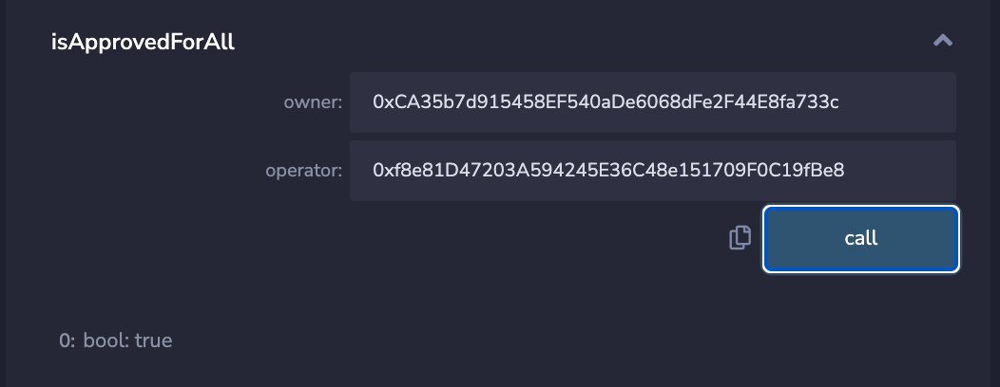
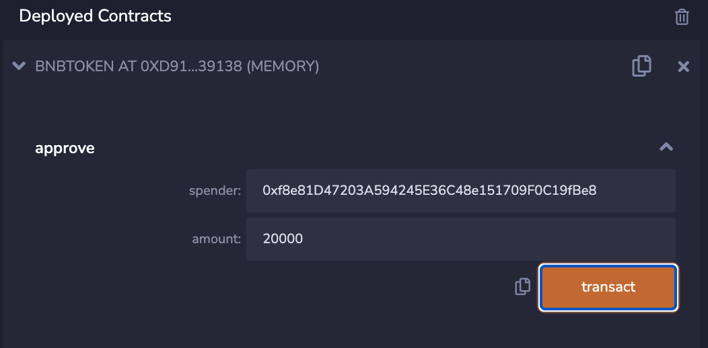

## I. Compile and deploy smart contract 

- STEP 1: Copy the source code to [remix.ethereum.org](https://remix.ethereum.org/). It will looks like this:

- STEP 2: Check "Auto compile" checkbox in compiler configuration section:

- STEP 3: Deploy these contracts:

After successful deployment, you will see a screen like this

## II. Set values

- User address:

USER A: 0x5B38Da6a701c568545dCfcB03FcB875f56beddC4 (Token owner and deployer)

USER B: 0xAb8483F64d9C6d1EcF9b849Ae677dD3315835cb2

USER C: 0xCA35b7d915458EF540aDe6068dFe2F44E8fa733c

- Contract address:

TOKEN ADDRESS: 0xd9145CCE52D386f254917e481eB44e9943F39138

NFT ADDRESS: 0xd8b934580fcE35a11B58C6D73aDeE468a2833fa8

MARKETPLACE ADDRESS: 0xf8e81D47203A594245E36C48e151709F0C19fBe8

- STEP 1: USER A transfer 1000000 token to USER B

- STEP 2: USER A transfer NFT ID 100 to USER C

## III. Make a transaction

Let's say USER B wants to buy USER C's NFT ID 100 for 10000 TOKEN and MARKETPLACE will take 20% of the transaction fee. 
Here are the steps you do it:

- STEP 1: Allow MARKETPLACE ADDRESS to transfer any NFT owned by USER C:

(NOTE: call function from address C)

- STEP 2: Allow MARKETPLACE ADDRESS to transfer 20000 TOKEN from USER B to any address

(NOTE: call function from address B)

- STEP 3: Make a swap from USER B

USER B is now the owner of NFT ID 100

Balance of USER C

Balance of USER B

Balance of USER A

## Reference

- https://github.com/OpenZeppelin/openzeppelin-contracts/blob/master/contracts/token/ERC721/ERC721.sol

- https://github.com/OpenZeppelin/openzeppelin-contracts/blob/master/contracts/token/ERC20/ERC20.sol
